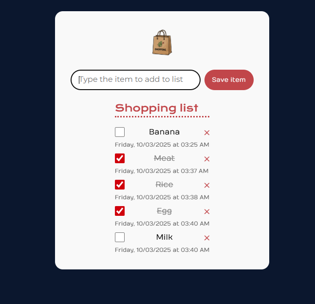

# 🛒 Shopping List App

🟨 JavaScript (ES6 Modules) – For dynamic functionality and interactivity

🎨 CSS3 – For styling, layout, and responsive design

📄HTML5 – For structuring the web page

## ✨ About the Project

A simple Shopping List application built with HTML, CSS, and JavaScript.
It allows you to dynamically add items, mark them as completed, and view the date and time each item was created.

## 🛠 Features

Acess the webpage at https://shopping-list-three-omega.vercel.app/

Add items to the list.

Strike through items when the checkbox is checked.

Display the date and time each item was added.

Automatic message when the list is empty.

Works with dynamically created items.

Responsive and styled layout.

## 📦 Project Structure

```text
shopping-list/
│
├── index.html           # Main page
├── css/
│   └── styles.css       # Application styles
├── js/
│   ├── index.js         # Main script
│   ├── createListElement.js
│   ├── createDate.js
│   ├── checkbox.js
│   └── emptyList.js
├── assets/
│   └── bag.png
└── README.md


## 🚀 How to Use

Access the webpage at https://shopping-list-three-omega.vercel.app/

Type the item name and click Save item or press Enter.

Check the checkbox to mark the item as completed.

View the date and time each item was added.

## 📸 Preview




## 📝 Author

Felipe Macedo

GitHub: https://github.com/IFelipeMacedo

LinkedIn: https://www.linkedin.com/in/felipe-macedo-kelner/

